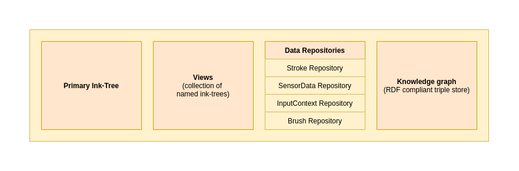
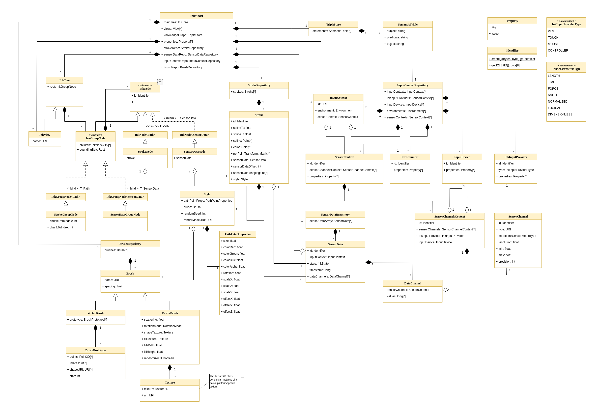
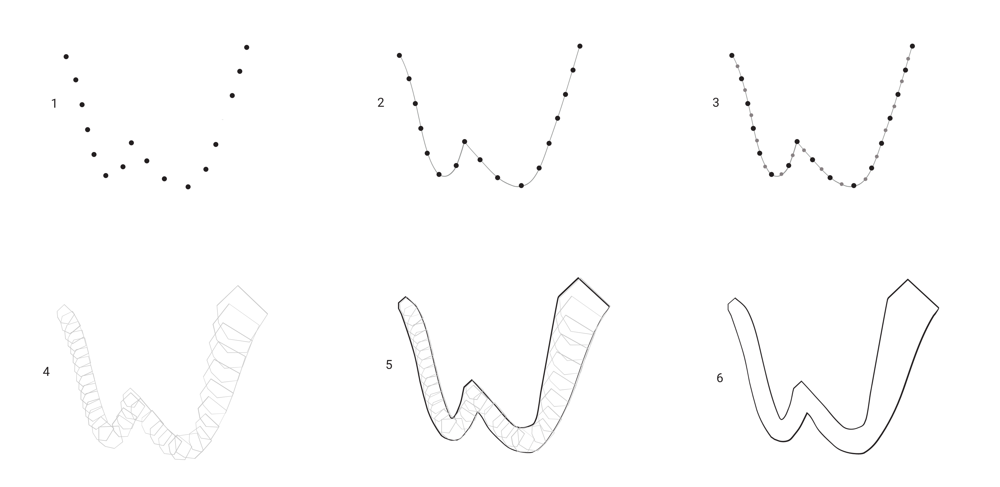
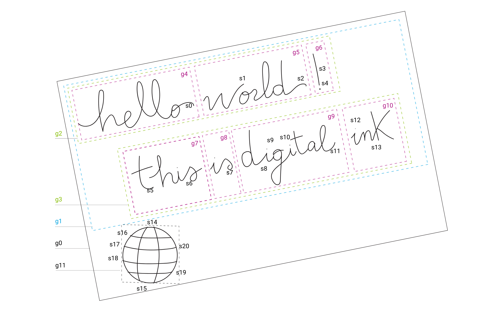

# Universal Ink Library
This Python library is designed to work with Universal Ink Models (UIM).
The UIM defines a language-neutral and platform-neutral data model for representing and manipulating digital ink data captured using an electronic pen or stylus, or using touch input.

The main aspects of the UIM are:

- Interoperability of ink-based data models by defining a standardized interface with other systems
- Biometric data storage mechanism
- Spline data storage mechanism
- Rendering configurations storage mechanism
- Ability to compose spline/raw-input based logical trees, which are contained within the ink model
- Portability, by enabling conversion to common industry standards
- Extensibility, by enabling the description of ink data related semantic metadata
- Standardized serialization mechanism

This reference document defines a RIFF container and Protocol Buffers schema for serialization of ink models as well as 
a standard mechanism to describe relationships between different parts of the ink model, and/or between parts of the ink 
model and external entities.

The specified serialization schema is based on the following standards:

- **Resource Interchange File Format (RIFF)** - A generic file container format for storing data in tagged chunks
- **Protocol Buffers v3** - A language-neutral, platform-neutral extensible mechanism for serializing structured data
- **Resource Description Framework (RDF)** - A standard model for data interchange on the Web
- **OWL 2 Web Ontology Language (OWL2)** - An ontology language for the Semantic Web with formally defined meaning

## Data Model
The *Universal Ink Model* has five fundamental categories:

- **Input data**: A collection of data repositories, holding raw sensor input, input device/provider configurations, sensor channel configurations, etc. Each data repository keeps certain data-sets isolated and is responsible for specific type(s) of data
- **Ink data**: The visual appearance of the digital ink, presented as ink geometry with rendering configurations
- **Metadata**: Related meta-data about the environment, input devices, etc.
- **Ink Trees / Views**: A collection of logical trees, representing structures of hierarchically organized paths or raw input data-frames
- **Semantic triple store**: An RDF compliant triple store, holding semantic information, such as text structure, handwriting recognition results, and semantic entities

The diagram below illustrates the different logical parts of the ink model.


This UML diagram illustrates the complete Ink Model in terms of logical models and class dependencies.


The *Universal Ink Model* provides the flexibility required for a variety of applications, since the display of pen data is only one aspect.
For example, the same data can be used for data mining or even signature comparison, while the ink display can be on a range of platforms potentially requiring different scaling and presentation.

## Input data

In reality, pen data is captured from a pen device as a set of positional points:


Depending on the type of hardware, in addition to the X/Y positional coordinates, the points can contain further information such as pen tip force and angle.
Collectively, this information is referred to as sensor data and the *Universal Ink Model* provides a means of storing all the available data.
For example, with some types of hardware, pen hover coordinates can be captured while the pen is not in contact with the surface.
The information is saved in the *Universal Ink Model* and can be used when required.

## Ink data

A significant function of WILL processing is the rendering of pen data.
Pen strokes are identified as continuous sets of pen coordinates captured while the pen is in contact with the surface. 
For example, writing the letter ‘w', as illustrated below.
The process converts each pen stroke into a mathematical representation, which can then be used to render the shape on a display.
Steps in the so-called Ink Geometry pipeline are illustrated below where each step is configured by an application to generate the desired output:



As a result, the data points are smoothed and shaped to produce the desired representation. 
For example, simulating the appearance of a felt-tip ink pen.
Raster and vector rendering is supported with a selection of rendering brush types.

The results are saved as Ink data, containing ink geometry and rendering information.

## Metadata

Metadata is added as data about the pen data.
The *Universal Ink Model* allows for administrative information such as author name, location, pen data source, etc.
Further metadata is computed by analysis of the pen data.
An example of digital ink is annotated below:



The labels identify pen strokes *s1, s2, s3*, etc.
In addition, groups of strokes are identified as *g1, g2, g3*, etc.
Pen strokes are passed to a handwriting recognition engine, and the results are stored as additional metadata, generally referred to as semantic data.
The semantic data is stored with reference to the groups, categorized as single characters, individual words, lines of text, and so on.

# Remarks

The libary is used for machine learning experiments based on digital ink using the Universal Ink Model. 
Its is still under development, so **we do not recommend to use it yet for production environments**.
Moreover, it is not following any formal QA and release process.

# Installation

Our Universal Ink Library can be installed using pip.

``bash
    $ pip install universal-ink-library
``

# Documentation
You can find more detailed technical documentation, [here](https://developer-docs.wacom.com/sdk-for-ink/docs/model).
API documenation is available [here](docs/uim/index.html).

# Library

## Format
Contains generated format parser stubs for Universal Ink Model.

### Codec
The writer serialises the internal *Universal Ink Model* structure in different serialisation formats.


### Parser
The parsers use the format stubs to convert data from the files into internal *InkModel* structure.


## Model
Memory model *InkModel* of Universal Ink Model.

## Data format support

### Universal Ink Model
Parsing of UIM file.

```python
from uim.codec.parser.uim import UIMParser
from uim.model.ink import InkModel

parser: UIMParser = UIMParser()
# Parse a UIM file version 3.0.0
ink_model_1: InkModel = UIMParser().parse('../ink/uim_3.0.0/1) Value of Ink 1.uim')
# Parse a UIM file version 3.1.0
ink_model_2: InkModel = UIMParser().parse('../ink/uim_3.1.0/1) Value of Ink 1.uim')

```
Or manually build model

```python
from uim.model.base import UUIDIdentifier
from uim.model.ink import InkModel, InkTree
from uim.model.inkdata.brush import VectorBrush, BrushPolygon, BrushPolygonUri, RasterBrush, RotationMode, BlendMode
from uim.model.inkdata.strokes import Spline, Style, Stroke, LayoutMask
from uim.model.inkinput.inputdata import Environment, InkInputProvider, InkInputType, InputDevice, SensorChannel, \
    InkSensorType, InkSensorMetricType, SensorChannelsContext, SensorContext, InputContext
from uim.model.inkinput.sensordata import SensorData, InkState
from uim.model.semantics import syntax
from uim.model.semantics.node import StrokeGroupNode, StrokeNode, StrokeFragment, URIBuilder
from uim.model.semantics.syntax import SemanticTriple, CommonViews
from uim.utils.matrix import Matrix4x4

if __name__ == '__main__':
    """Creates an ink model from the scratch."""
    # Create the model
    ink_model: InkModel = InkModel()
    # Setting a unit scale factor
    ink_model.unit_scale_factor = 1.5
    # Using a 4x4 matrix for scaling
    ink_model.transform = Matrix4x4.create_scale(1.5)

    # Properties are added as key-value pairs
    ink_model.properties.append(("Author", "John"))
    ink_model.properties.append(("PrimaryLanguage", "en_US"))
    ink_model.properties.append(("OtherStuff", "Yes"))

    # Create an environment
    env: Environment = Environment()
    env.properties.append(("env.name", "My Environment"))
    env.properties.append(("os.id", "98765"))
    env.properties.append(("os.name", "Windows"))
    env.properties.append(("os.version", "10.0.18362.239"))
    env.properties.append(("os.build", "239"))
    env.properties.append(("os.platform", "whatever"))
    ink_model.input_configuration.environments.append(env)

    # Ink input provider can be pen, mouse or touch.
    provider: InkInputProvider = InkInputProvider(input_type=InkInputType.MOUSE)
    provider.properties.append(("pen.id", "1234567"))
    ink_model.input_configuration.ink_input_providers.append(provider)

    # Input device is the sensor (pen tablet, screen, etc.)
    input_device: InputDevice = InputDevice()
    input_device.properties.append(("dev.id", "123454321"))
    input_device.properties.append(("dev.manufacturer", "Wacom"))
    input_device.properties.append(("dev.model", "Mobile Studio Pro"))
    input_device.properties.append(("dev.cpu", "Intel"))
    input_device.properties.append(("dev.graphics.display", "Dell 1920x1080 32bit"))
    input_device.properties.append(("dev.graphics.adapter", "NVidia"))
    ink_model.input_configuration.devices.append(input_device)

    # Create a group of sensor channels
    sensor_channels_tablet: list = [
        SensorChannel(channel_type=InkSensorType.TIMESTAMP, metric=InkSensorMetricType.TIME, resolution=1.0),
        SensorChannel(channel_type=InkSensorType.X, metric=InkSensorMetricType.LENGTH, resolution=1.0),
        SensorChannel(channel_type=InkSensorType.Y, metric=InkSensorMetricType.LENGTH, resolution=1.0)
    ]

    scc_tablet: SensorChannelsContext = SensorChannelsContext(channels=sensor_channels_tablet,
                                                              ink_input_provider_id=provider.id,
                                                              input_device_id=input_device.id)

    # We can create an additional input device, for example one providing pressure via Bluetooth
    input_device_bluetooth: InputDevice = InputDevice()
    input_device_bluetooth.properties.append(("dev.id", "345456567"))
    input_device_bluetooth.properties.append(("dev.manufacturer", "Apple"))
    ink_model.input_configuration.devices.append(input_device_bluetooth)

    sensor_channels_bluetooth: list = [
        SensorChannel(channel_type=InkSensorType.TIMESTAMP, metric=InkSensorMetricType.TIME, resolution=1.0),
        SensorChannel(channel_type=InkSensorType.PRESSURE, metric=InkSensorMetricType.FORCE, resolution=1.0),
    ]

    scc_bluetooth: SensorChannelsContext = SensorChannelsContext(input_device_id=input_device_bluetooth.id,
                                                                 channels=sensor_channels_bluetooth)

    # Add all sensor channel contexts
    sensor_context: SensorContext = SensorContext()
    sensor_context.add_sensor_channels_context(scc_tablet)
    sensor_context.add_sensor_channels_context(scc_bluetooth)
    ink_model.input_configuration.sensor_contexts.append(sensor_context)

    # Create the input context using the Environment and the Sensor Context
    input_context: InputContext = InputContext(environment_id=env.id, sensor_context_id=sensor_context.id)
    ink_model.input_configuration.input_contexts.append(input_context)

    # Create sensor data
    sensor_data_0: SensorData = SensorData(UUIDIdentifier.id_generator(), input_context_id=input_context.id,
                                           state=InkState.PLANE)

    sensor_data_0.add_timestamp_data(sensor_channels_tablet[0], [0, 1, 2, 4, 5])
    sensor_data_0.add_data(sensor_channels_tablet[1],  [100.4, 103.7, 110.1])
    sensor_data_0.add_data(sensor_channels_tablet[2],  [200.1, 202.0, 207.0])

    sensor_data_0.add_timestamp_data(sensor_channels_bluetooth[0], [0, 1, 2])

    sensor_data_0.add_data(sensor_channels_bluetooth[1], [100, 200])

    # Add sensor data to the model
    ink_model.sensor_data.add(sensor_data_0)

    # We need to define a brush polygon
    points: list = [(10, 10), (0, 10), (0, 0)]
    brush_polygons: list = [BrushPolygon(min_scale=0., points=points)]

    # Create the brush object using polygons
    vector_brush_0: VectorBrush = VectorBrush(
        "app://qa-test-app/vector-brush/MyTriangleBrush",
        brush_polygons)

    # Add it to the model
    ink_model.brushes.add_vector_brush(vector_brush_0)

    # Add a brush specified with shape Uris
    poly_uris: list = [
        BrushPolygonUri("will://brush/3.0/shape/Circle?precision=20&radius=1", 0.),
        BrushPolygonUri("will://brush/3.0/shape/Ellipse?precision=20&radiusX=1&radiusY=0.5", 4.0)
    ]

    vector_brush_1: VectorBrush = VectorBrush(
        "app://qa-test-app/vector-brush/MyEllipticBrush",
        poly_uris)

    raster_brush_0: RasterBrush = RasterBrush(
        name="app://qa-test-app/raster-brush/MyRasterBrush",
        spacing=10., scattering=5., rotation=RotationMode.TRAJECTORY, shape_textures=[bytes([10, 20]),
                                                                                      bytes([30, 20])],
        fill_width=2.0, fill_height=0.3,
        fill_texture=bytes([10, 10, 20, 15, 17, 20, 25, 16, 34, 255, 23, 0, 34, 255, 23, 255]),
        randomize_fill=False, blend_mode=BlendMode.SOURCE_OVER)

    # Add it to the model
    ink_model.brushes.add_raster_brush(raster_brush_0)

    raster_brush_1: RasterBrush = RasterBrush(
        name="app://qa-test-app/raster-brush/MyRasterBrush1",
        spacing=10.0, scattering=5.0, rotation=RotationMode.TRAJECTORY, fill_width=2., fill_height=0.3,
        fill_texture_uri="app://qa-test-app/raster-brush-fill/mixedShapesGL",
        shape_texture_uris=[
            "app://qa-test-app/raster-brush-shape/mixedShapesGL_128x128",
            "app://qa-test-app/raster-brush-shape/mixedShapesGL_64x64",
            "app://qa-test-app/raster-brush-shape/mixedShapesGL_32x32",
            "app://qa-test-app/raster-brush-shape/mixedShapesGL_16x16"
        ], randomize_fill=False, blend_mode=BlendMode.SOURCE_OVER)

    ink_model.brushes.add_raster_brush(raster_brush_1)
    ink_model.brushes.add_vector_brush(vector_brush_1)

    # Specify the layout of the stroke data, in this case the stroke will have variable X, Y and Size properties.
    layout_mask: int = LayoutMask.X.value | LayoutMask.Y.value | LayoutMask.SIZE.value

    # Provide the stroke data - in this case 4 data points, each consisting of X, Y, Size
    path: list = [
        10., 10.7, 1.0,
        21.0, 20.2, 2.0,
        30.0, 12.4, 2.1,
        40.0, 15.0, 1.5
    ]

    # Create a spline object from the path data
    spline: Spline = Spline(layout_mask, path)

    # Create some style
    style: Style = Style(brush_uri=vector_brush_0.name)
    style.path_point_properties.red = 1.0
    style.path_point_properties.green = 0.0
    style.path_point_properties.blue = 0.4
    style.path_point_properties.alpha = 1.0

    # Create a stroke object. Note that it just exists, but is not in the model yet.
    stroke_0: Stroke = Stroke(sid=UUIDIdentifier.id_generator(), spline=spline, style=style)

    # Create a spline object - 9 data points, each consisting of X, Y, Size, Red, Green, Blue, Alpha
    spline_1: Spline = Spline(
        LayoutMask.X.value | LayoutMask.Y.value | LayoutMask.SIZE.value | LayoutMask.RED.value | LayoutMask.GREEN.value
        | LayoutMask.BLUE.value | LayoutMask.ALPHA.value,
        [10.0, 10.7, 1.0, 0.5, 0.0, 0.1, 1.0,
         21.0, 20.2, 2.0, 0.9, 0.4, 0.2, 0.8,
         30.0, 12.4, 2.1, 0.7, 0.1, 0.1, 0.7,
         40.0, 15.0, 1.5, 0.3, 0.5, 0.4, 1.0,
         50.0, 45.0, 1.0, 0.3, 0.5, 0.4, 1.0,
         41.0, 53.0, 1.1, 0.2, 0.3, 0.5, 0.9,
         33.0, 73.0, 1.2, 0.6, 0.7, 0.4, 0.8,
         20.0, 84.0, 1.3, 0.7, 0.8, 0.3, 0.7,
         10.0, 91.0, 1.1, 0.7, 0.9, 0.2, 0.6]
    )

    # Create a style
    style_1: Style = Style(brush_uri=raster_brush_0.name)
    style_1.path_point_properties.rotation = 0.35

    # The render mode URI can also be app specific like app://blabla
    # The URI will://rasterization/3.0/blend-mode/SourceOver is assumed and must not be set.
    style_1.render_mode_uri = "will://rasterization/3.0/blend-mode/DestinationOver"

    # Create a stroke object. Note that it just exists, but is not in the model yet.
    stroke_1: Stroke = Stroke(UUIDIdentifier.id_generator(), spline=spline_1, style=style_1)

    # First you need a root group to contain the strokes
    root: StrokeGroupNode = StrokeGroupNode(UUIDIdentifier.id_generator())

    # Assign the group as the root of the main ink tree
    ink_model.ink_tree = InkTree()
    ink_model.ink_tree.root = root

    # Add a node for stroke 0
    stroke_node_0: StrokeNode = StrokeNode(stroke_0, StrokeFragment(0, 1, 0.0, 1.0))
    root.add(stroke_node_0)

    # Add a node for stroke 1
    root.add(StrokeNode(stroke_1, StrokeFragment(0, 1, 0.0, 1.0)))

    # Adding view for handwriting recognition results
    hwr_tree: InkTree = InkTree(CommonViews.HWR_VIEW.value)
    # Add view right after creation, to avoid warnings that tree is not yet attached
    ink_model.add_view(hwr_tree)

    hwr_root: StrokeGroupNode = StrokeGroupNode(UUIDIdentifier.id_generator())
    hwr_tree.root = hwr_root

    # Here you can add the same strokes as in the main tree, but you can organize them in a different way
    # (put them in different groups)
    # You are not supposed to add strokes that are not already in the main tree.
    hwr_root.add(StrokeNode(stroke_0, StrokeFragment(0, 1, 0.0, 1.0)))

    # A view node can refer to a fragment of a stroke.
    hwr_root.add(StrokeNode(stroke_1, StrokeFragment(0, 1, 0.0, 1.0)))

    # The hwr root denotes a word
    ink_model.knowledge_graph.append(SemanticTriple(hwr_root.uri, syntax.CommonRDF.PRED_RDF_HAS_TYPE, syntax.WORD))
    ink_model.knowledge_graph.append(SemanticTriple(hwr_root.uri, syntax.Semantics.PRED_IS, "Wacom"))

    # We need an URI builder
    uri_builder: URIBuilder = URIBuilder()

    # Create a named entity
    named_entity_uri: str = uri_builder.build_named_entity_uri(UUIDIdentifier.id_generator())
    ink_model.knowledge_graph.append(SemanticTriple(hwr_root.uri, syntax.Semantics.PRED_HAS_NAMED_ENTITY_DEFINITION,
                                                    named_entity_uri))

    # Add knowledge for the named entity
    ink_model.knowledge_graph.append(SemanticTriple(named_entity_uri, "entityType", "Organization"))
    ink_model.knowledge_graph.append(SemanticTriple(named_entity_uri, "basedIn", "Japan"))
    ink_model.knowledge_graph.append(SemanticTriple(named_entity_uri, "hasConfidence", "0.85"))

    # Save the model, this will overwrite an existing file
    with io.open('3_1_0.uim', 'wb') as uim:
        # unicode(data) auto-decodes data to unicode if str
        uim.write(UIMEncoder310().encode(ink_model))
```


Serialising *InkModel* as a Universal Ink Model file.

```python
from uim.codec.writer.encoder.encoder_3_1_0 import UIMEncoder310
from uim.model.ink import InkModel

ink_model: InkModel = InkModel()
... 

# Save the model, this will overwrite an existing file
with io.open('3_1_0.uim', 'wb') as uim:
    # unicode(data) auto-decodes data to unicode if str
    uim.write(UIMEncoder310().encode(ink_model))
```


